# Image Captioning
An application that help generate caption for a list of selected travel images so that user can reduce caption creation effort when they post them in social media.

# 0_Setup
## Computer Selection
Make sure your purchased computer had support GPU and native Window.

## Resources
1. Install this github repository in your local device.
2. Make sure to change file structure as such:

```
Downloads/
└── ImageCaption/
    ├── 0_Setup/
    |   └──requirements.txt
    ├── 1_Data/
    │   ├── glove.2024.wikigiga.300d.zip/
    │   │   └── wiki_giga_2024_300_MFT20_vectors_seed_2024_alpha_0.75_eta_0.05_combined.txt
    │   ├── IC30K.zip/
    │   │   └── flickr30k_images/
    │   │       └── flickr30k_images/
    │   │           └── ....jpg
    │   └── results.csv
    ├── 2_Model/
    |   ├── LSTM
    |   |   └──ImageCaption30K_LSTM.ipynb
    |   └──Transformer
    |       └──ImageCaption30K_Transformer.ipynb
    ├── README.md
    └── Screenshots
            ├── CaptionLength_LSTM.png
            ├── CaptionLength_Transformer.png
            ├── Dataset_LSTM.png
            ├── Dataset_Transformer.png
            ├── Result_LSTM.png
            ├── Result_Transformer.png
            ├── Training_LSTM.png
            ├── Training_Transformer.png
            ├── WordOccurrences_LSTM.png
            └── WordOccurrences_Transformer.png
```

## Virtual Envitronment Setup
1. Install Anaconda ```https://www.anaconda.com/download```
2. Open Ananconda Prompt to check CUDA and , ```nvidia-smi```, else install from (https://developer.nvidia.com/cuda-11-8-0-download-archive?target_os=Windows&target_arch=x86_64&target_version=11&target_type=exe_local)
3. Then, create an virtual environment, ```conda create -n ImageCaption python=3.10```
4. Then, activate the environment, ```conda activate ImageCaption```

## Kernel Setup
1. Then, install all dependency, ```pip install -r C:/Users/User/Downloads/ImageCaption/0_Setup/requirements.txt```
2. Then, create an external kernel, ```python -m ipykernel install --user --name=ImageCaption --display-name "ImageCaption"```
3. Open ```C:\Users\User\Downloads\ImageCaption\2_Model\LSTM\ImageCaption30K_LSTM.ipynb``` as Jupyter Notebook and then select "ImageCaption" kernel

In case need to add/update the external kernel:
1. Open Anancoda Prompt
2. Then, activate the environment, ```conda activate ImageCaption```
3. Then, add/modify using ```pip install``` or ```pip uninstall```
4. Restart kernel in Jupyter Notebook

In case need to remove the external kernel:
1. Open Anancoda Prompt
2. To check available kernel to delete, ```jupyter kernelspec list```
3. To remove kernel from Jupyter Notebook, ```jupyter kernelspec uninstall imagecaption```
4. For clean up, remove the entire folder, ```C:\Users\User\anaconda3\envs\ImageCaption```

# 1_Data
1. Flickr30k dataset (https://www.kaggle.com/datasets/hsankesara/flickr-image-dataset) for medium-sized image captioning
2. GloVe: Global Vectors for Word Representation (https://nlp.stanford.edu/projects/glove/) for LSTM embedding purpose

# 2_Model
## Data Cleaning
- Image Augmentation
- Remove unnecessary string on a caption
- Remove extreme short and long caption

## EDA
### LSTM
#### Dataset
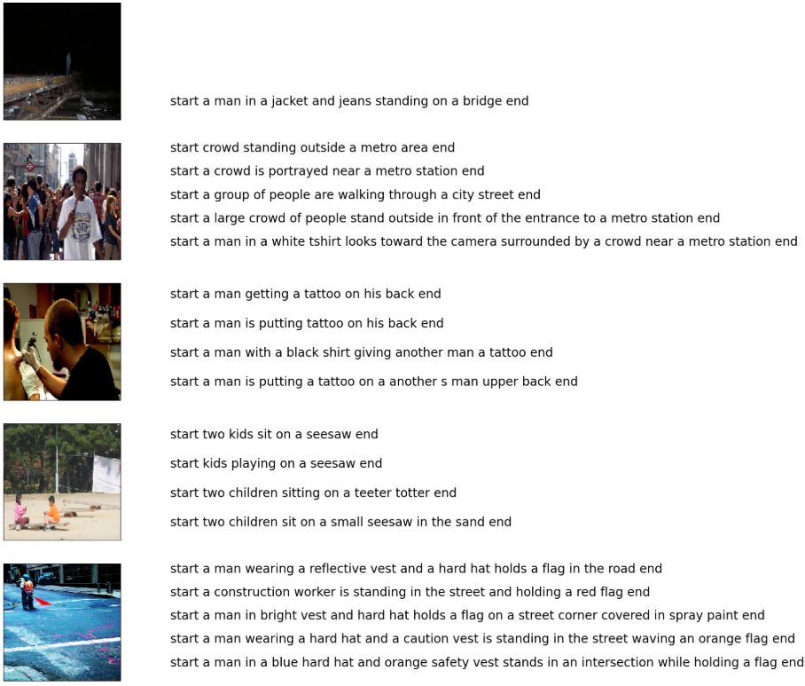

#### Caption Length
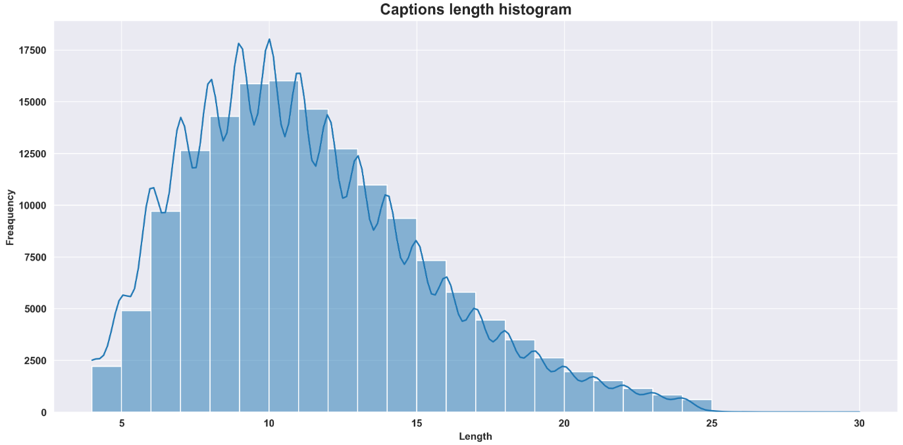

#### Word Occurrences
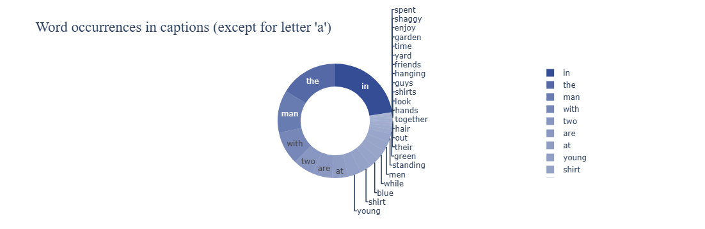

### Transformer
#### Dataset
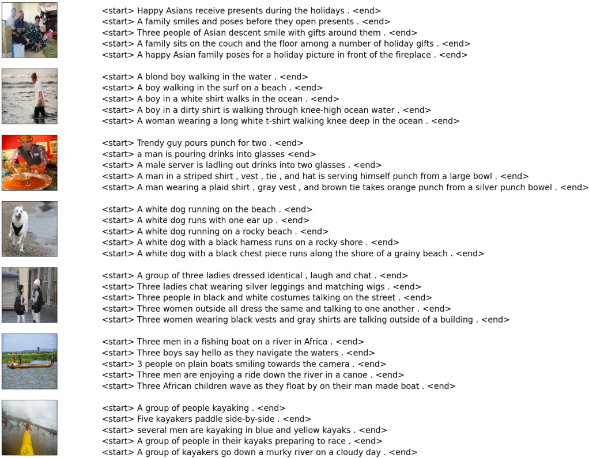

#### Caption Length
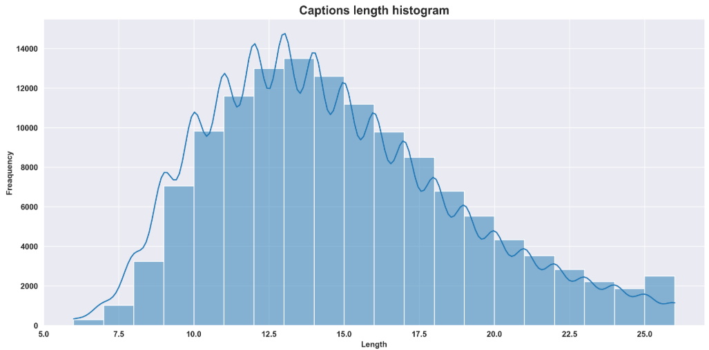

#### Word Occurrences
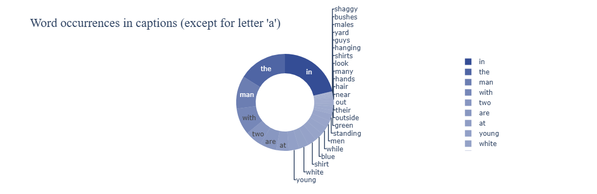

## Data Splitting
|  | LSTM | Transformer |
| :---: | :---: | :---: |
| Train | 75% |  | 78% |
| Validation | 15% | 20% |
| Test | 10% | 2% |

## Build
### LSTM
- LSTM is the baseline and the simplest model to explore.
- Using EfficientNet convolutional neural network (CNN) on LSTM with InceptionV3 as input using image features and embedding with GLove Dataset.

### Transformer
- Transfomer has stated a better result compare to LSTM, so I explore it after LSTM.
- Using EfficientNet convolutional neural network (CNN) on decoded and encoded image with positional embedding.

## Performance
### LSTM
#### Training
Epoch 1/100
1016/1016 [==============================] - 649s 628ms/step - loss: 7.3727 - val_loss: 5.8685
Epoch 2/100
1016/1016 [==============================] - 457s 450ms/step - loss: 5.3160 - val_loss: 4.6572
Epoch 3/100
1016/1016 [==============================] - 451s 444ms/step - loss: 4.5867 - val_loss: 4.3085
Epoch 4/100
1016/1016 [==============================] - 447s 440ms/step - loss: 4.3563 - val_loss: 4.1453
Epoch 5/100
1016/1016 [==============================] - 439s 432ms/step - loss: 4.2179 - val_loss: 4.0440
Epoch 6/100
1016/1016 [==============================] - 458s 451ms/step - loss: 4.1196 - val_loss: 3.9616
Epoch 7/100
1016/1016 [==============================] - 456s 449ms/step - loss: 4.0460 - val_loss: 3.9034
Epoch 8/100
1016/1016 [==============================] - 470s 462ms/step - loss: 3.9857 - val_loss: 3.8638
Epoch 9/100
1016/1016 [==============================] - 473s 466ms/step - loss: 3.9370 - val_loss: 3.8219
Epoch 10/100
1016/1016 [==============================] - 475s 467ms/step - loss: 3.8951 - val_loss: 3.7920
Epoch 11/100
1016/1016 [==============================] - 478s 471ms/step - loss: 3.8599 - val_loss: 3.7702
Epoch 12/100
1016/1016 [==============================] - 473s 466ms/step - loss: 3.8271 - val_loss: 3.7509
Epoch 13/100
1016/1016 [==============================] - 477s 469ms/step - loss: 3.7999 - val_loss: 3.7317
Epoch 14/100
1016/1016 [==============================] - 471s 464ms/step - loss: 3.7751 - val_loss: 3.7177
Epoch 15/100
1016/1016 [==============================] - 477s 470ms/step - loss: 3.7517 - val_loss: 3.7049
Epoch 16/100
1016/1016 [==============================] - 475s 467ms/step - loss: 3.7308 - val_loss: 3.6933
Epoch 17/100
1016/1016 [==============================] - 476s 468ms/step - loss: 3.7110 - val_loss: 3.6863
Epoch 18/100
1016/1016 [==============================] - 479s 471ms/step - loss: 3.6926 - val_loss: 3.6787
Epoch 19/100
1016/1016 [==============================] - 481s 473ms/step - loss: 3.6773 - val_loss: 3.6706
Epoch 20/100
1016/1016 [==============================] - 481s 473ms/step - loss: 3.6607 - val_loss: 3.6661
Epoch 21/100
1016/1016 [==============================] - 474s 467ms/step - loss: 3.6452 - val_loss: 3.6602
Epoch 22/100
1016/1016 [==============================] - 478s 470ms/step - loss: 3.6317 - val_loss: 3.6519
Epoch 23/100
1016/1016 [==============================] - 477s 470ms/step - loss: 3.6181 - val_loss: 3.6466
Epoch 24/100
1016/1016 [==============================] - 478s 470ms/step - loss: 3.6060 - val_loss: 3.6393
Epoch 25/100
1016/1016 [==============================] - 478s 471ms/step - loss: 3.5935 - val_loss: 3.6327
Epoch 26/100
1016/1016 [==============================] - 472s 465ms/step - loss: 3.5822 - val_loss: 3.6302
Epoch 27/100
1016/1016 [==============================] - 476s 468ms/step - loss: 3.5721 - val_loss: 3.6292
Epoch 28/100
1016/1016 [==============================] - 476s 469ms/step - loss: 3.5609 - val_loss: 3.6224
Epoch 29/100
1016/1016 [==============================] - 479s 471ms/step - loss: 3.5532 - val_loss: 3.6205
Epoch 30/100
1016/1016 [==============================] - 479s 472ms/step - loss: 3.5438 - val_loss: 3.6187
Epoch 31/100
1016/1016 [==============================] - 477s 470ms/step - loss: 3.5341 - val_loss: 3.6145
Epoch 32/100
1016/1016 [==============================] - 473s 466ms/step - loss: 3.5257 - val_loss: 3.6121
Epoch 33/100
1016/1016 [==============================] - 475s 467ms/step - loss: 3.5175 - val_loss: 3.6021
Epoch 34/100
1016/1016 [==============================] - 478s 471ms/step - loss: 3.5078 - val_loss: 3.6002
Epoch 35/100
1016/1016 [==============================] - 484s 476ms/step - loss: 3.4985 - val_loss: 3.5969
Epoch 36/100
1016/1016 [==============================] - 483s 475ms/step - loss: 3.4901 - val_loss: 3.5926
Epoch 37/100
1016/1016 [==============================] - 490s 482ms/step - loss: 3.4832 - val_loss: 3.5909
Epoch 38/100
1016/1016 [==============================] - 491s 484ms/step - loss: 3.4741 - val_loss: 3.5897
Epoch 39/100
1016/1016 [==============================] - 489s 481ms/step - loss: 3.4675 - val_loss: 3.5872
Epoch 40/100
1016/1016 [==============================] - 488s 480ms/step - loss: 3.4597 - val_loss: 3.5858
Epoch 41/100
1016/1016 [==============================] - 483s 475ms/step - loss: 3.4521 - val_loss: 3.5864
Epoch 42/100
1016/1016 [==============================] - 493s 485ms/step - loss: 3.4457 - val_loss: 3.5981
Epoch 43/100
1016/1016 [==============================] - 491s 483ms/step - loss: 3.4394 - val_loss: 3.5989
Epoch 44/100
1016/1016 [==============================] - 488s 480ms/step - loss: 3.4325 - val_loss: 3.5944
Epoch 45/100
1016/1016 [==============================] - 493s 485ms/step - loss: 3.4252 - val_loss: 3.5931

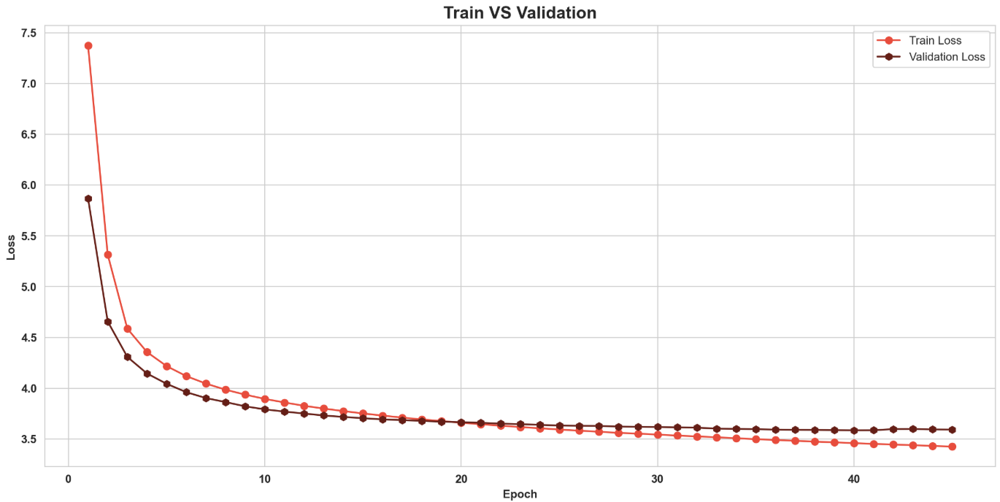

#### Result
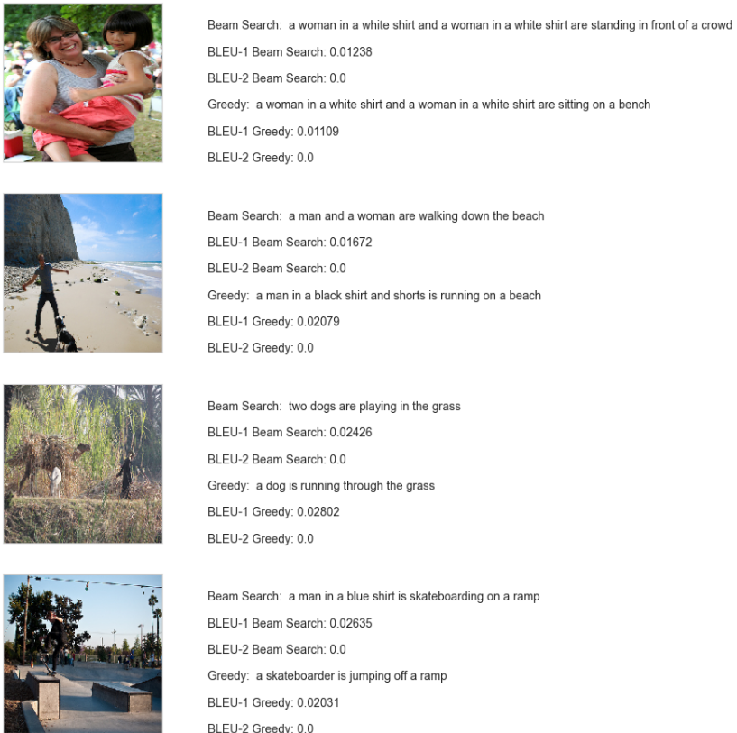

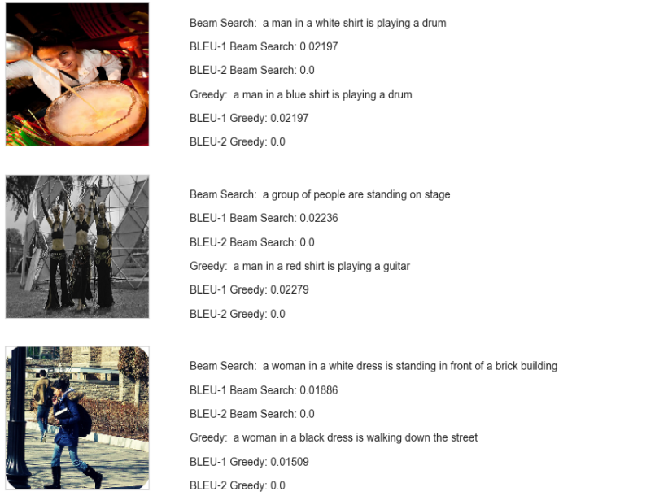

Cons:
- Consume more time on image extraction and training
- The lowest accuracy (2%)
- Bad at single and multiple word learning

Pros:
- The loss is low (3.5)
- Better generalization with some fine tuning on label smoothing, image augmentation, embedding, learning rate, dense layer and dropout.

### Transformer
#### Training
Epoch 1/30
654/654 [==============================] - 318s 447ms/step - loss: 18.5483 - acc: 0.1724 - val_loss: 14.8495 - val_acc: 0.3607
Epoch 2/30
654/654 [==============================] - 285s 435ms/step - loss: 14.6122 - acc: 0.3659 - val_loss: 14.0976 - val_acc: 0.3873
Epoch 3/30
654/654 [==============================] - 297s 454ms/step - loss: 13.9762 - acc: 0.3943 - val_loss: 13.8019 - val_acc: 0.3988
Epoch 4/30
654/654 [==============================] - 6124s 9s/step - loss: 13.5999 - acc: 0.4128 - val_loss: 13.6581 - val_acc: 0.4048
Epoch 5/30
654/654 [==============================] - 3150s 5s/step - loss: 13.3618 - acc: 0.4266 - val_loss: 13.6020 - val_acc: 0.4082
Epoch 6/30
654/654 [==============================] - 675s 1s/step - loss: 13.2443 - acc: 0.4338 - val_loss: 13.5932 - val_acc: 0.4084
Epoch 7/30
654/654 [==============================] - 322s 493ms/step - loss: 13.2226 - acc: 0.4361 - val_loss: 13.5932 - val_acc: 0.4083
Epoch 8/30
654/654 [==============================] - 323s 495ms/step - loss: 13.2177 - acc: 0.4368 - val_loss: 13.5932 - val_acc: 0.4086
Epoch 9/30
654/654 [==============================] - 326s 498ms/step - loss: 13.2212 - acc: 0.4367 - val_loss: 13.5932 - val_acc: 0.4087

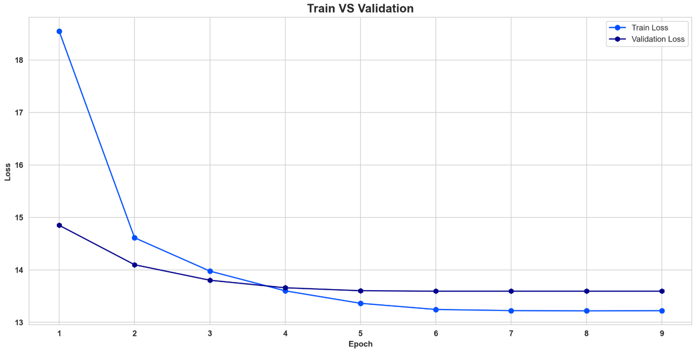

#### Result
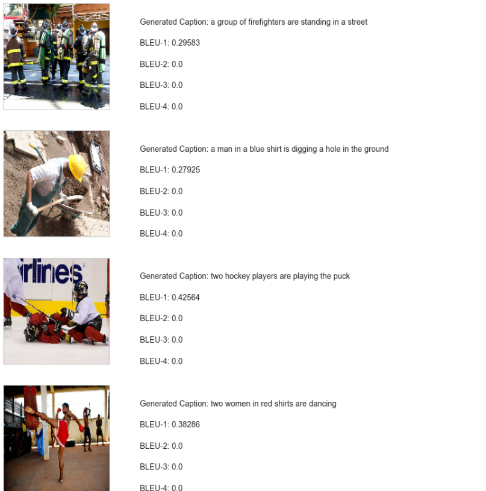

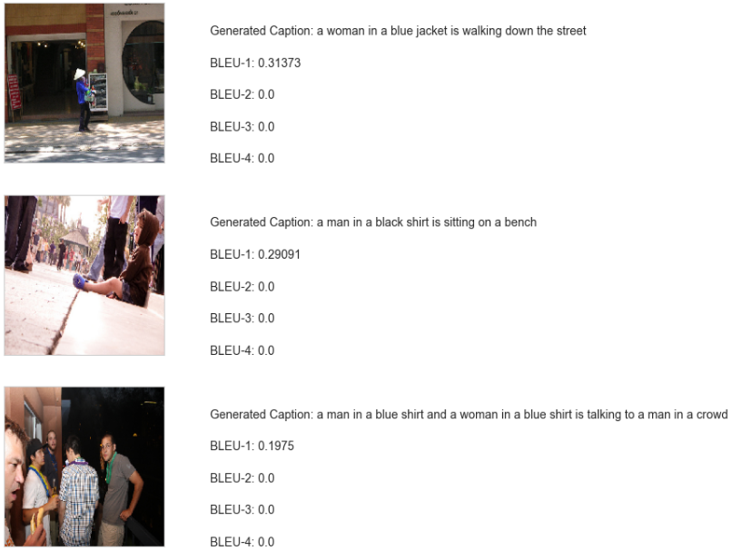

Cons:
- Bad at multiple word learning
- The loss is higher than LSTM (13.5)

Pros:
- Better at single word learning compare to LSTM
- Consume lesser time on image encode and decode and training time is shorter compare to LSTM
- Better accuracy than LSTM (40%)
- Better generalization with some fine tuning on label smoothing, image augmentation, embedding, learning rate, dense layer and dropout.

